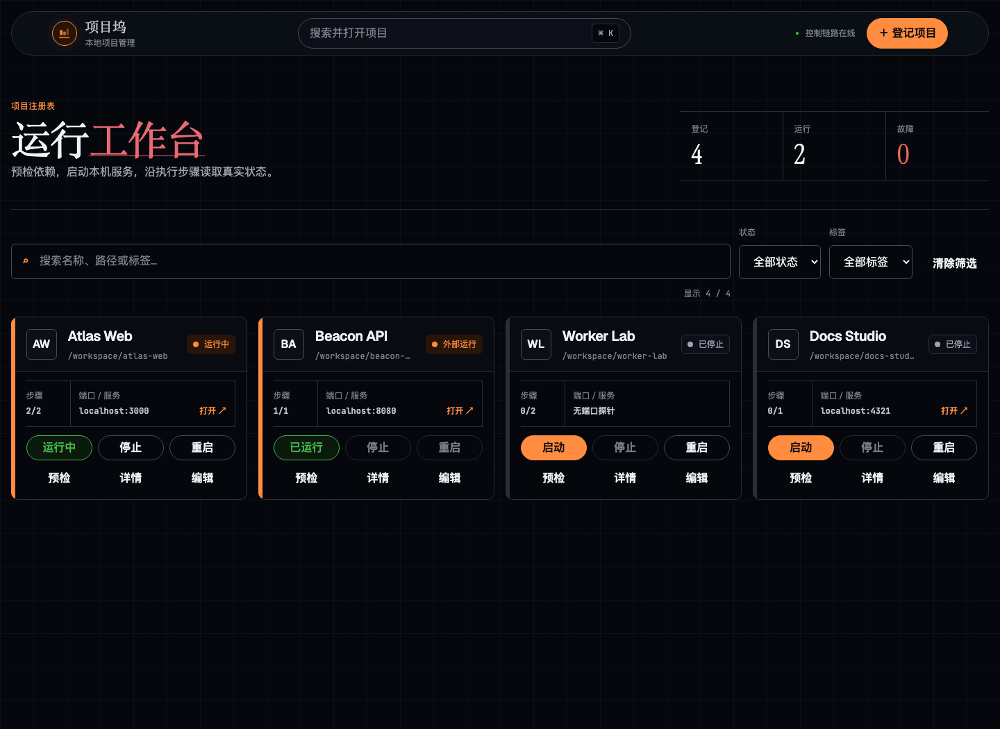
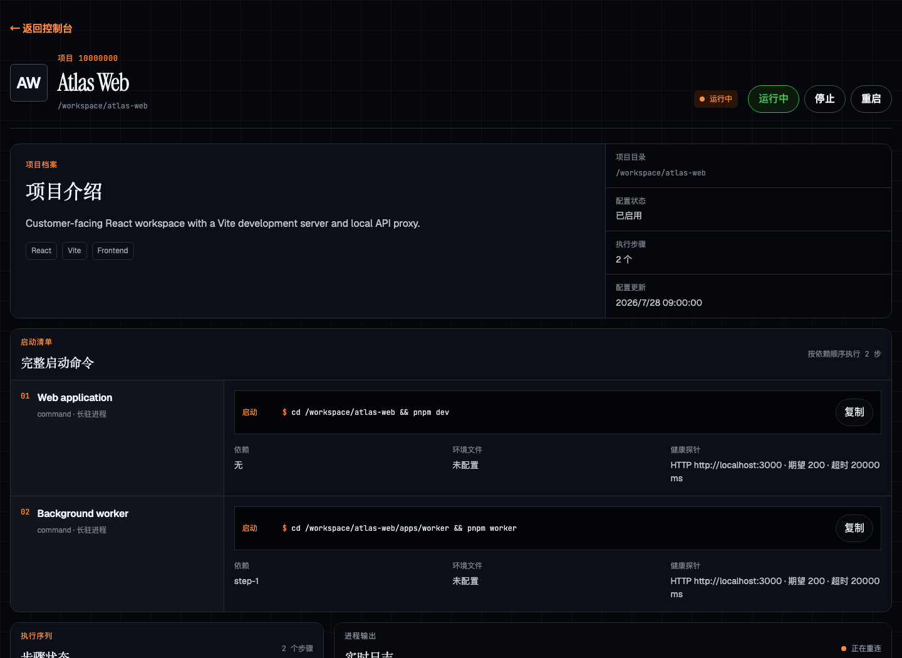
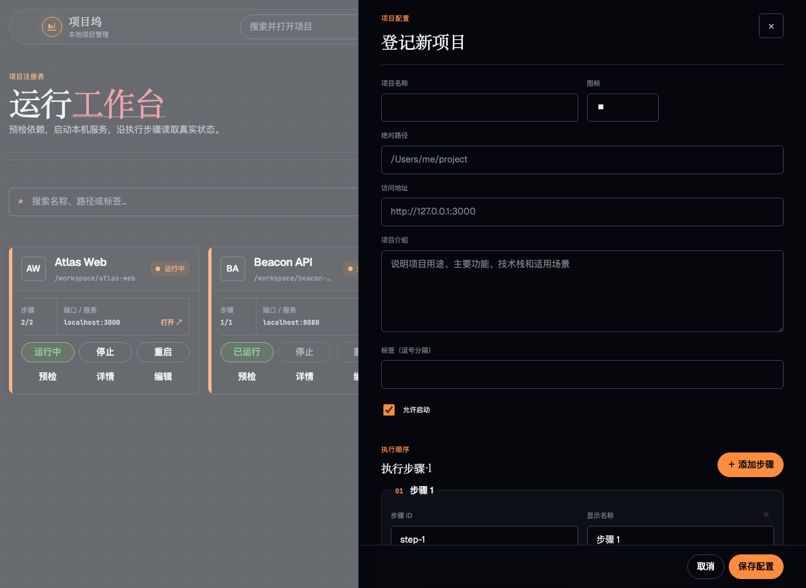

<p align="center">
  
</p>

<h1 align="center">Project Dock</h1>

<p align="center">
  Configure, start, stop, and observe your development projects from one local dashboard.
</p>

<p align="center">
  <a href="README.md">简体中文</a> ·
  <a href="README_EN.md">English</a>
</p>



## Features

- Manage commands, Docker Compose services, dependencies, and environment files
  through one configuration model.
- Check paths, executables, occupied ports, and health probes before startup.
- Control process lifecycles and roll back previously started steps on failure.
- Detect services started in another terminal to prevent duplicate starts or
  accidental stops.
- Observe HTTP, TCP, and process health alongside real-time logs.
- Assign a service URL to each project and open it directly from the dashboard.
- Add, edit, and remove projects in the UI without changing source code.

<p>
  
  
</p>

## Architecture

- Web: React 19, Vite, TanStack Query, React Router
- API: Fastify, TypeScript, Server-Sent Events
- Data: Node.js SQLite
- Contracts: shared Zod schemas
- Testing: Vitest, Testing Library, Playwright

```text
apps/web          React dashboard
apps/server       Local API and process manager
packages/contracts Shared data contracts
configs           Optional project templates
```

## Quick start

Requires Node.js 24+ and pnpm 10+:

```bash
git clone https://github.com/tingfengyinyue/local-project-manager.git
cd local-project-manager
pnpm install
pnpm dev
```

Open `http://127.0.0.1:4311`. The API runs at
`http://127.0.0.1:4310` by default.

## Project configuration

Projects can be created and edited in the UI. Every field is validated by the
shared `@lpm/contracts` package. By default, the server allows projects under
`~/Projects` and `~/Documents`. Add more roots with:

```bash
LPM_ALLOWED_ROOTS="$HOME/Projects:$HOME/Developer" pnpm dev
```

To import a template on first startup:

```bash
cp configs/example-projects.json configs/personal-projects.json
LPM_SEED_FILE="$PWD/configs/personal-projects.json" pnpm dev
```

Project data is stored in `~/.local-project-manager/projects.sqlite`.
`configs/personal-projects.json`, databases, logs, and `.env` files are excluded
from Git.

## Security boundaries

- The server listens on `127.0.0.1` and only permits local CORS origins.
- Commands use an executable plus an argument array; shell strings are not run.
- Project Dock only stops processes that it started and registered.
- Projects, working directories, and environment files must stay inside approved
  roots.
- `.env` files are loaded by path only and are never displayed or persisted.

## Verification

```bash
pnpm typecheck
pnpm test
pnpm test:e2e
pnpm build
```

See the
[`architecture design`](docs/plans/2026-07-24-local-project-manager-design.md)
for implementation details.

MIT License
